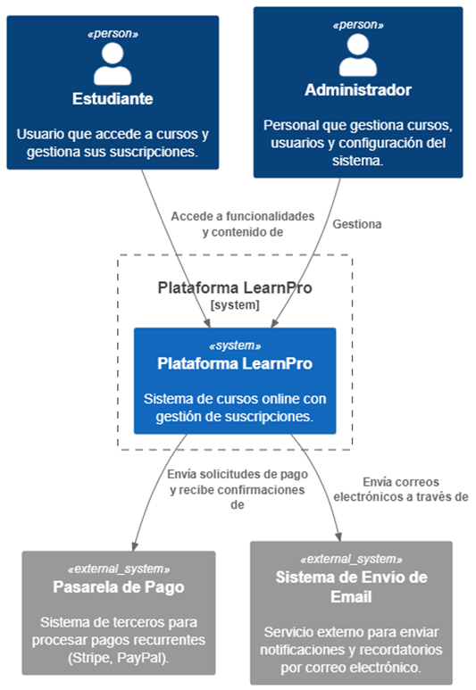
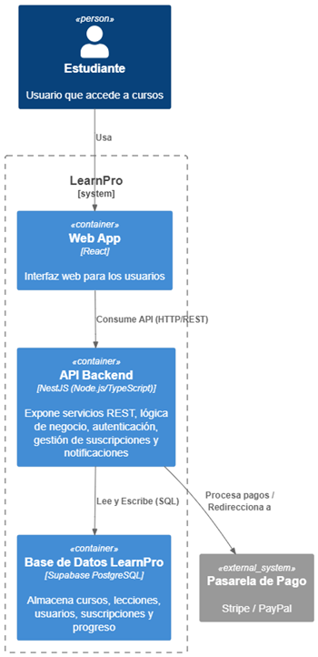
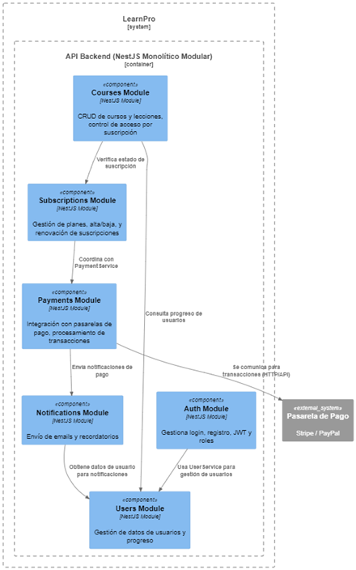

## Integrantes del Proyecto

| Nombre Completo        | Usuario de GitHub         |
|------------------------|---------------------------|
| Naomi Carolina Delgado Anchundia   | [@delgadonaomi]
| Gonzalo Alexander Delgado Macias   | [@Alex-20kd]
| Kristhian Augusto Bello Soledispa  | [@KristhianBello]
| Carlos Alberto Delgado Campuzano   | [@carlos-73CK]

Documentación Arquitectónica – LearnPro
1. Introducción y Objetivos
LearnPro es una plataforma de educación en línea basada en un modelo de suscripción mensual o anual. Permite a los usuarios acceder a cursos y lecciones de forma personalizada y estructurada. Está orientada a facilitar el aprendizaje continuo con funcionalidades como seguimiento de progreso, notificaciones y recordatorios automáticos.
Objetivos de Arquitectura:
•	Escalabilidad horizontal: Para manejar el crecimiento de usuarios y la demanda de acceso a los cursos.
•	Alta disponibilidad: Para asegurar el acceso constante a los cursos sin interrupciones significativas.
•	Modularidad: Para permitir un mantenimiento eficiente y una evolución controlada por componentes.
•	Seguridad: Crucial en la gestión de pagos y el control de acceso a contenido.
2. Restricciones
•	Tecnología Web: Se utilizará una aplicación de una sola página (SPA) para el frontend.
•	Backend: Desarrollado en Node.js, utilizando el framework NestJS.
•	Base de Datos: Se empleará PostgreSQL como sistema de gestión de bases de datos.
•	Pasarelas de Pago: Las integraciones deben ser compatibles con Stripe y PayPal.
•	Cumplimiento Normativo: Adherencia a GDPR para la protección de datos personales.
•	Internacionalización: La plataforma debe estar disponible en inglés y español.

3. Interesados y sus Objetivos
Interesado	Objetivo
Estudiantes	Acceso fluido y personalizado a los cursos según su suscripción.
Administradores	Gestionar contenido y suscripciones eficientemente.
Desarrolladores	Facilidad para extender funcionalidades y mantener el sistema.
Equipo de Marketing	Acceder a métricas de uso para mejorar conversión y retención.
Soporte Técnico	Diagnóstico rápido de problemas y mantenimiento seguro.
4. Contexto y Alcance
El sistema LearnPro se posiciona como el núcleo central para la gestión de cursos y suscripciones. Interactúa con usuarios (Estudiantes y Administradores) y sistemas externos clave para su operación.

Diagrama de Contexto (C1):

 
Descripción del Contexto:
•	Los usuarios (Estudiantes y Administradores) acceden a la plataforma desde el frontend web.
•	Las suscripciones y pagos se gestionan con pasarelas externas (Stripe, PayPal).
•	El backend controla el acceso a contenido y el progreso del usuario, y se comunica con un sistema de notificaciones externo.
5. Estrategia de Solución
La plataforma LearnPro adoptará una arquitectura Monolítica Modular. Esta elección busca equilibrar la simplicidad de un único despliegue con los beneficios de organización y mantenibilidad de una arquitectura modular. El sistema se estructurará internamente en módulos bien definidos, cada uno con responsabilidades específicas, facilitando la implementación de patrones de diseño y el cumplimiento de los requisitos de calidad.
Tecnologías Clave:
•	Frontend (Web App): React
•	Backend (API Backend): NestJS (Node.js/TypeScript)
•	Base de Datos: Supabase PostgreSQL
•	Pasarelas de Pago: Stripe, PayPal
•	Despliegue Local: Docker Compose
•	CI/CD: GitHub Actions
6. Vista de Bloques de Construcción (Visión Lógica)
El sistema LearnPro se compone de una aplicación web frontend y un backend API monolítico modular, que interactúan con una base de datos centralizada y pasarelas de pago externas.

Diagrama de Contenedores (C2):
 

Componentes Principales del API Backend (Diagrama C3):

El API Backend (NestJS) se organiza en los siguientes módulos principales:
 

7. Vista de Ejecución
•	Procesamiento de Solicitudes: Cada solicitud del usuario desde el frontend es procesada por el backend (API REST).
•	Tareas Periódicas: Las tareas periódicas, como el envío de notificaciones o la verificación de suscripciones, se ejecutarán mediante cron jobs o workers gestionados por el backend (NestJS).
•	Interacción con Terceros: El backend interactúa con servicios de terceros (pasarelas de pago) mediante llamadas API y maneja webhooks entrantes para confirmaciones de pago.
8. Vista de Despliegue
La arquitectura se basa en contenedores para facilitar el despliegue y la escalabilidad.
Diagrama de Despliegue (simplificado):
[Browser] -> [Nginx / Load Balancer] -> [App Node.js (NestJS)] -> [PostgreSQL DB (Supabase)]
                                          |
                                          +--> [Worker de notificaciones (interno al App Node.js)]
                                          +--> [Stripe/PayPal Webhooks Handler (interno al App Node.js)]

Detalles de Implementación:
•	Contenedores: La aplicación Node.js (NestJS) se empaquetará en un contenedor Docker.
•	Base de Datos: Se utilizará Supabase PostgreSQL como servicio gestionado, eliminando la necesidad de desplegar y mantener un contenedor de base de datos propio.
•	Balanceador de Carga: En producción, se utilizará un balanceador de carga (ej. Nginx o el balanceador nativo del proveedor cloud) para distribuir el tráfico entre múltiples instancias del backend.
•	Ambientes: Se configurarán ambientes de desarrollo, staging y producción con despliegues automatizados (CI/CD con GitHub Actions).
•	Backups: Se implementarán backups automatizados de la base de datos de Supabase.
9. Conceptos Transversales
•	Seguridad:
o	Autenticación basada en JWT para la gestión de sesiones.
o	Encriptación de datos sensibles (ej. contraseñas de usuarios) en reposo y en tránsito.
o	Implementación de Rate Limiting en el API Gateway (NestJS) para prevenir ataques de fuerza bruta.
o	Uso de Row Level Security (RLS) en Supabase para control de acceso a datos a nivel de fila, complementando la seguridad del backend.
•	Resiliencia:
o	Manejo de reintentos (retry) y mecanismos de fallback en llamadas a servicios externos (especialmente pasarelas de pago).
o	Manejo de errores centralizado y logging robusto.
•	Auditoría:
o	Registro (logging) de eventos clave del sistema, como accesos, intentos de pago, errores y cambios importantes en el contenido o suscripciones.
•	Accesibilidad:
o	Diseño de una interfaz web responsiva que se adapte a diferentes dispositivos.
o	Consideración de estándares de accesibilidad (ej. WCAG) para compatibilidad con lectores de pantalla y otras tecnologías asistivas.
•	Internacionalización (i18n):
o	Implementación de mecanismos para soportar múltiples idiomas (inglés y español) en el frontend y, si es necesario, en las notificaciones del backend.
10. Decisiones de Arquitectura
•	Elección de Modelo Arquitectónico (Monolito Modular): Se opta por un monolito modular para equilibrar la simplicidad de despliegue con la necesidad de modularidad y mantenibilidad. Permite una evolución controlada y una posible futura migración a microservicios si la escala lo requiere.
•	Framework Backend (NestJS): Seleccionado por su estructura modular, soporte robusto para REST/GraphQL, inyección de dependencias, y facilidad para implementar patrones de diseño y middlewares. Su base en TypeScript mejora la calidad y mantenibilidad del código.
•	Base de Datos (Supabase PostgreSQL): Elegido por ser un servicio PostgreSQL gestionado, lo que reduce la carga operativa de la base de datos, además de ofrecer un ecosistema de herramientas (autenticación, almacenamiento) que pueden simplificar el desarrollo.
•	Pasarelas de Pago (Stripe, PayPal): Seleccionadas por su amplia adopción, robustez en pagos recurrentes y APIs bien documentadas.
•	Patrones de Diseño Obligatorios:
o	Repository Pattern: Para abstraer la capa de persistencia y desacoplar la lógica de negocio de los detalles de la base de datos.
o	Strategy Pattern: Para encapsular algoritmos intercambiables, como diferentes métodos de pago o tipos de notificación.
o	Factory Method: Para la creación de objetos complejos, como instancias de clientes de pasarelas de pago.
o	Singleton: Para asegurar que ciertas clases (ej. servicios de configuración o loggers) tengan una única instancia global (los servicios de NestJS son singletons por defecto).

